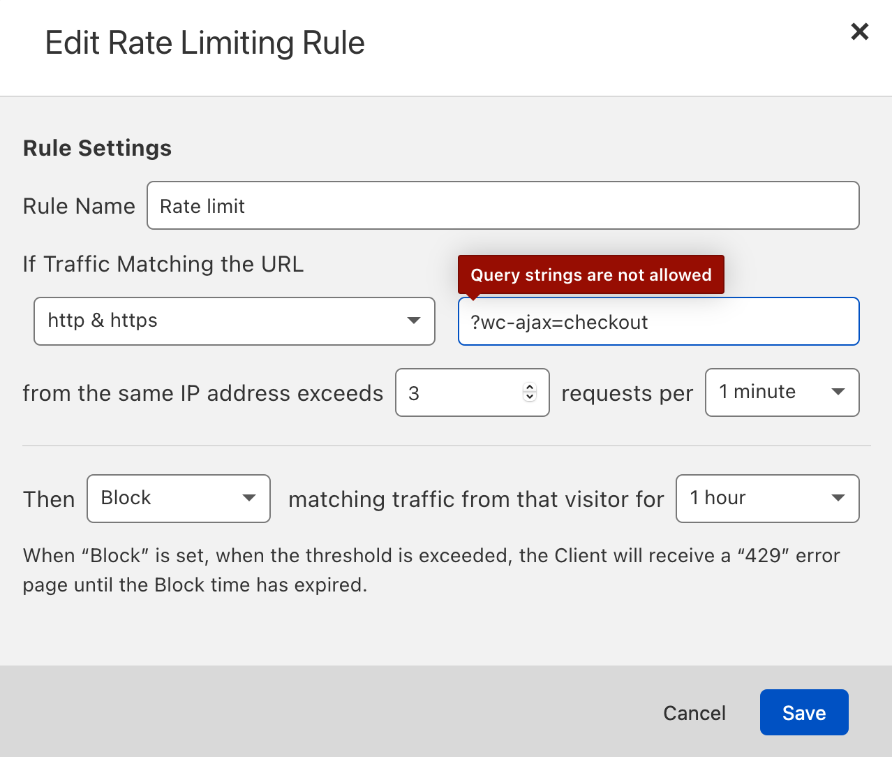

[](https://wordpress.org/plugins/plugin_slug) [](https://github.com/WordPress-Coding-Standards/WordPress-Coding-Standards) [](https://brianhenryie.github.io/bh-wc-checkout-rate-limiter/)

# Checkout Rate Limiter

Rate limit "Place Order" on WooCommerce checkout.

Rate limits `/?wc-ajax=checkout` by IP.

## Install

Download the latest version from [releases](https://github.com/BrianHenryIE/bh-wc-checkout-rate-limiter/releases) and configure inside WooCommerce settings:


Then when the "Place Order" button on checkout is pressed to frequently, the customer will be blocked:


Three rates can be set, progressively punishing problematic people.

## Background

Your website can be attacked by running 100s of fake credit card numbers through your gateway. Your gateway will often charge per transaction, even if they are declined. You also likely have a daily limit of transactions and of total number of transactions. When this is reached, you can no longer take legitimate orders. Some examples:  

#### Anyone know how I can limit a brute force order attempt (woocommerce)

[21 Sept 2017](https://www.reddit.com/r/Wordpress/comments/71o4qa/anyone_know_how_i_can_limit_a_brute_force_order/) on [reddit.com/r/Wordpress](https://reddit.com/r/Wordpress)

> So we are having problems of people who purchased some list of like 100 credit card numbers and try to place an order with us. We see in the order notes "Your transaction has been declined" come up in these people like 30 times meaning they tried 30 different credit cards.
>
> So I'm wondering if there is a way to automatically block the customer's IP address from ordering if they received over 3 failed attempts.

#### How to prevent a carding attack on a woocommerce site?

[26 Feb 2020](https://www.reddit.com/r/woocommerce/comments/fa4ytb/how_to_prevent_a_carding_attack_on_a_woocommerce/) on [reddit.com/r/woocommerce](https://reddit.com/r/woocommerce)

> Today we had something new happen... our credit card processor temporarily disabled our account because they said someone was using our site to run a carding attack on the site.
>
> Has anyone dealt with this before? Did you go with reCaptcha or another method? Curious about the details.
> 
> One thing I don't get is how they're doing this without placing a ton of orders. I'm sure it is some URL or something but curious about how it would work.

#### Hundreds of failed orders, some switched to completed without admin action

[14 April 2020](https://www.reddit.com/r/woocommerce/comments/g12pdg/hundreds_of_failed_orders_some_switched_to/) on [reddit.com/r/woocommerce](https://reddit.com/r/woocommerce)

> Yesterday, my small shop started receiving hundreds of failed orders from the same "person" (bot). The same name and billing info, and IP address were used for all of these failed orders. Different credit card numbers were used (all Mastercard). The order was for the cheapest item in the shop.
> 
> ...
> 
> I first blacklisted the origin's IP, but the same thing began happening immediately from another IP. I knew blacklisting that wouldn't help, so I switched the shop to only allow orders from users with accounts.
>
> ...
> 
> I'm contacting my processor today to see how much trouble I'm in.

## Operation

This solution uses rate limiting per IP address to stop how often one IP can send a request to `/?wc-ajax=checkout`

The WooCommerce code to handle `/?wc-ajax=checkout` can be found at:

* [class-wc-ajax.php:24](https://github.com/woocommerce/woocommerce/blob/09b5fb4691555f3c541c58354d09d91a35347504/includes/class-wc-ajax.php#L24) `add_action( 'template_redirect', array( __CLASS__, 'do_wc_ajax' ), 0 );` 
* In [WC_Ajax::do_wc_ajax()](https://github.com/woocommerce/woocommerce/blob/09b5fb4691555f3c541c58354d09d91a35347504/includes/class-wc-ajax.php#L90)  `do_action( 'wc_ajax_' . $action );`, which in our case `$action` is `checkout`
* The actual `wc_ajax_checkout` is the [WC_AJAX::checkout()](https://github.com/woocommerce/woocommerce/blob/09b5fb4691555f3c541c58354d09d91a35347504/includes/class-wc-ajax.php#L461-L468) function, which I think is [added at default priority 10](https://github.com/woocommerce/woocommerce/blob/09b5fb4691555f3c541c58354d09d91a35347504/includes/class-wc-ajax.php#L114-L120), making it easy to slip in before. 

Then, the simplified version of what this plugin does is:

```php
add_action( 'wc_ajax_checkout', 'rate_limit_checkout', 0 );

function rate_limit_checkout() {
    $rate_limiter = new WordPress_RateLimiter();
    
    $ip_address = WC_Geolocation::get_ip_address();
    
    try {
        $rate_limiter->limit( $ip_address, Rate::perMinute( 5 ) );
        
    } catch (LimitExceeded $exception) {
       wp_send_json_error( null, 429 );
    }
}
```

### Detail

Rather than write my own rate limiting code, I used [nikolaposa/rate-limit](https://github.com/nikolaposa/rate-limit/), then added a [PSR-16 wrapper for it](https://github.com/BrianHenryIE/bh-wc-checkout-rate-limiter/blob/v1.0.0/src/API/RateLimiter/Psr16RateLimiter.php) ([PSR-16)](
https://github.com/php-fig/simple-cache), and used a [PSR-16 implementation of WordPress transients](https://github.com/wp-oop/transient-cache) as the cache. All that code _should_ be external to this plugin. 

The niceties of the plugin are:

* Logs
* Settings link on plugins.php
* Settings link as admin notice for one week after activation (if not configured)

## Notes

The correct way to address this problem for most people is with a captcha. We were not using captcha because when we enabled a captcha, customers could not checkout. Ultimately, this was a problem with [WooCommerce Anti-Fraud](https://woocommerce.com/products/woocommerce-anti-fraud/), a plugin with a litany of issues, and no effort to address them.

Additionally, if you use Cloudflare, the logical thing would be to use [Cloudflare's rate limiting](https://www.cloudflare.com/rate-limiting/):



Where [Cloudflare's rate limiting](https://www.youtube.com/watch?v=monBTXwtzi8) should be used – I wish there were a tool to take recent Apache access logs and determine a 75% percentile customer access/minute, then rate limit everyone else. (where '75' can be learned).

### Transients / Cache

Although this plugin is using transients, WordPress's implementation of transients ([option.php:791's get_transient()](https://github.com/WordPress/WordPress/blob/058f9903676a7efaee534a682df0a2a8b87574d8/wp-includes/option.php#L791)) defers their storage to any available [object cache](https://developer.wordpress.org/reference/classes/wp_object_cache/#Persistent_Caching). Using the object cache directly presumably affords benefits.

```php 
function get_transient( $transient ) {
    ...
    if ( wp_using_ext_object_cache() ) {
	    $value = wp_cache_get( $transient, 'transient' );
```

### WordFence

WordFence has [rate limiting](https://www.wordfence.com/help/firewall/rate-limiting/) but it did not offer the option to be specific to `/?wc-ajax=checkout`. When I looked at its general rate limiting, and at Cloudflare's rate limiting, it is very hard to determine the correct numbers. 

### Cooling off

When a limit is reached, an additional punishment seems reasonable. This could be achieved easily with another transient.

### Empty cart

The author of one of the Reddit posts quoted above replied to my query (after I had written most of this!), and the interesting difference of approach was that he emptied the "customer"'s cart every time they exceeded the rate limit. Clever! The only reason I haven't done it here is because the time taken so far. I like it, but I'm not sure I need it. 

### WC_Rate_Limiter

Having already written the cruz of this, while I was searching my project, I found the class [WC_Rate_Limiter](https://github.com/woocommerce/woocommerce/blob/5.1.0/includes/class-wc-rate-limiter.php). It doesn't seem to be an appropriate replacement, but it's always enlightening to see another corner of the WooCommerce code I haven't encountered.  

### WP REST Cop

A rate limiter for the WP REST API: [WP REST Cop](https://github.com/cedaro/wprestcop). I looked at this initially and hoped I could fork it or use it as a library, but as I read more I opted, after some hops, for the other approach. I'm a fan of the author, whose [SatisPress plugin](https://github.com/cedaro/satispress) is essential. 

### Selenium

Jundging by the logs I've seen, the attack I've seen was probably via [Selenium](https://en.wikipedia.org/wiki/Selenium_(software)).

I saw that based on the User-Agent and the cadence of requests. Interesting articles:

* [How does reCAPTCHA 3 know I'm using Selenium/chromedriver?](https://stackoverflow.com/questions/55501524/how-does-recaptcha-3-know-im-using-selenium-chromedriver/55502835#55502835)
* [Can a website detect when you are using Selenium with chromedriver?](https://stackoverflow.com/questions/33225947/can-a-website-detect-when-you-are-using-selenium-with-chromedriver#41220267)
* ["Looks like the website is protected by Bot Management service provider Distil Networks and the navigation by
  ChromeDriver gets detected and subsequently blocked. Distil is like a bot firewall."](https://www.edureka.co/community/79066/avoid-bot-detection-not-working-with-selenium)
* Latest Chrome on Windows User Agents: "Mozilla/5.0 (Windows NT 10.0; Win64; x64) AppleWebKit/537.36 (KHTML, like Gecko) Chrome/89.0.4389.90 Safari/537.36
https://www.whatismybrowser.com/guides/the-latest-user-agent/chrome"

Captcha beats Selenium.

## See Also

In an unrelated project 

CSP Condition IP Address

## Contributing

Clone this repo, open PhpStorm, then run `composer install` to install the dependencies.

```
git clone https://github.com/brianhenryie/plugin_slug.git;
open -a PhpStorm ./;
composer install;
```

For integration and acceptance tests, a local webserver must be running with `localhost:8080/plugin_slug/` pointing at the root of the repo. MySQL must also be running locally – with two databases set up with:

```
mysql_username="root"
mysql_password="secret"

# export PATH=${PATH}:/usr/local/mysql/bin

# Make .env available 
# To bash:
# export $(grep -v '^#' .env.testing | xargs)
# To zsh:
# source .env.testing

# Create the database user:
# MySQL
# mysql -u $mysql_username -p$mysql_password -e "CREATE USER '"$TEST_DB_USER"'@'%' IDENTIFIED WITH mysql_native_password BY '"$TEST_DB_PASSWORD"';";
# or MariaDB
# mysql -u $mysql_username -p$mysql_password -e "CREATE USER '"$TEST_DB_USER"'@'%' IDENTIFIED BY '"$TEST_DB_PASSWORD"';";

# Create the databases:
mysql -u $mysql_username -p$mysql_password -e "CREATE DATABASE "$TEST_SITE_DB_NAME"; USE "$TEST_SITE_DB_NAME"; GRANT ALL PRIVILEGES ON "$TEST_SITE_DB_NAME".* TO '"$TEST_DB_USER"'@'%';";
mysql -u $mysql_username -p$mysql_password -e "CREATE DATABASE "$TEST_DB_NAME"; USE "$TEST_DB_NAME"; GRANT ALL PRIVILEGES ON "$TEST_DB_NAME".* TO '"$TEST_DB_USER"'@'%';";
```

### WordPress Coding Standards

See documentation on [WordPress.org](https://make.wordpress.org/core/handbook/best-practices/coding-standards/) and [GitHub.com](https://github.com/WordPress/WordPress-Coding-Standards).

Correct errors where possible and list the remaining with:

```
vendor/bin/phpcbf; vendor/bin/phpcs
```

### Tests

Tests use the [Codeception](https://codeception.com/) add-on [WP-Browser](https://github.com/lucatume/wp-browser) and include vanilla PHPUnit tests with [WP_Mock](https://github.com/10up/wp_mock). 

Run tests with:

```
vendor/bin/codecept run unit;
vendor/bin/codecept run wpunit;
vendor/bin/codecept run integration;
vendor/bin/codecept run acceptance;
```

Show code coverage (unit+wpunit):

```
XDEBUG_MODE=coverage composer run-script coverage-tests 
```

Static analysis:

```
vendor/bin/phpstan analyse --memory-limit 1G
```

To save changes made to the acceptance database:

```
export $(grep -v '^#' .env.testing | xargs)
mysqldump -u $TEST_SITE_DB_USER -p$TEST_SITE_DB_PASSWORD $TEST_SITE_DB_NAME > tests/_data/dump.sql
```

To clear Codeception cache after moving/removing test files:

```
vendor/bin/codecept clean
```

### More Information

See [github.com/BrianHenryIE/WordPress-Plugin-Boilerplate](https://github.com/BrianHenryIE/WordPress-Plugin-Boilerplate) for initial setup rationale. 

# Acknowledgements

https://www.reddit.com/user/bonadzz/