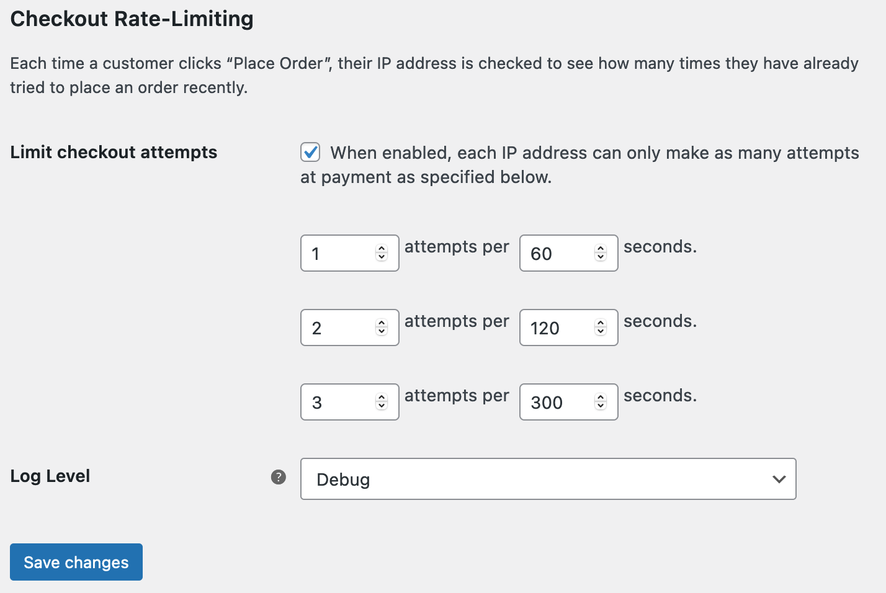
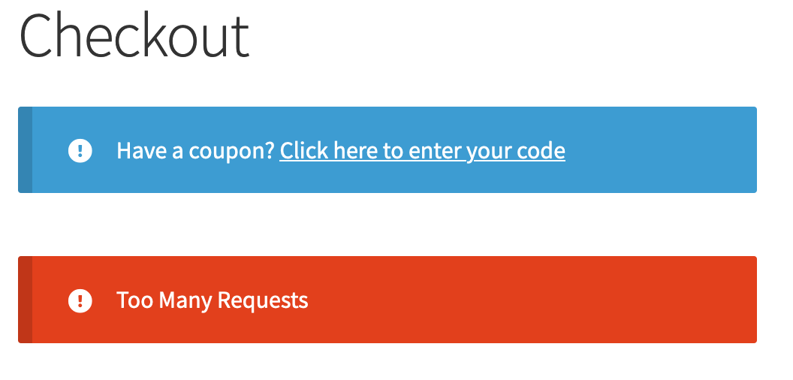

[](https://wordpress.org/plugins/plugin_slug) [](https://github.com/WordPress-Coding-Standards/WordPress-Coding-Standards) [](https://brianhenryie.github.io/bh-wc-checkout-rate-limiter/)

# Checkout Rate Limiter

Rate limit AJAX calls to WooCommerce checkout.

## Install

Download the latest version from [releases](https://github.com/BrianHenryIE/bh-wc-checkout-rate-limiter/releases) and configure inside WooCommerce settings:



Then when the "Place Order" button on checkout is pressed to frequently, the customer will be blocked:




## Background

Your website can be attacked by running 100s of fake credit card numbers through your gateway. Your gateway will often charge per transaction, even if they are declined. You also likely have a daily limit of transactions and of total number of transactions. When this is reached, you can no longer take legitimate orders. Some examples:  

#### Anyone know how I can limit a brute force order attempt (woocommerce)

[21 Sept 2017](https://www.reddit.com/r/Wordpress/comments/71o4qa/anyone_know_how_i_can_limit_a_brute_force_order/) on [reddit.com/r/Wordpress](https://reddit.com/r/Wordpress)

> So we are having problems of people who purchased some list of like 100 credit card numbers and try to place an order with us. We see in the order notes "Your transaction has been declined" come up in these people like 30 times meaning they tried 30 different credit cards.
>
> So I'm wondering if there is a way to automatically block the customer's IP address from ordering if they received over 3 failed attempts.

#### How to prevent a carding attack on a woocommerce site?

[26 Feb 2020](https://www.reddit.com/r/woocommerce/comments/fa4ytb/how_to_prevent_a_carding_attack_on_a_woocommerce/) on [reddit.com/r/woocommerce](https://reddit.com/r/woocommerce)

> Today we had something new happen... our credit card processor temporarily disabled our account because they said someone was using our site to run a carding attack on the site.
>
> Has anyone dealt with this before? Did you go with reCaptcha or another method? Curious about the details.
> 
> One thing I don't get is how they're doing this without placing a ton of orders. I'm sure it is some URL or something but curious about how it would work.

#### Hundreds of failed orders, some switched to completed without admin action

[14 April 2020](https://www.reddit.com/r/woocommerce/comments/g12pdg/hundreds_of_failed_orders_some_switched_to/) on [reddit.com/r/woocommerce](https://reddit.com/r/woocommerce)

> Yesterday, my small shop started receiving hundreds of failed orders from the same "person" (bot). The same name and billing info, and IP address were used for all of these failed orders. Different credit card numbers were used (all Mastercard). The order was for the cheapest item in the shop.
> 
> ...
> 
> I first blacklisted the origin's IP, but the same thing began happening immediately from another IP. I knew blacklisting that wouldn't help, so I switched the shop to only allow orders from users with accounts.
>
> ...
> 
> I'm contacting my processor today to see how much trouble I'm in.

## Solution

The solution is to rate limit how often one IP address can send a request to `/?wc-ajax=checkout`

The code to handle that URL can be found at:

* `class-wc-ajax.php:77`
* `add_action( 'template_redirect', array( __CLASS__, 'do_wc_ajax' ), 0 );`
* `WC_Ajax::do_wc_ajax()`
* `do_action( 'wc_ajax_' . $action );`

Then, the simplified version of what this plugin does is:

```php
add_action( 'wc_ajax_checkout', 'rate_limit_checkout', 0 );
function rate_limit_checkout() {
    $rate_limiter = new WordPress_RateLimiter();
    
    $ip_address = \WC_Geolocation::get_ip_address();
    
    try {
        $rate_limiter->limit($ip_address, Rate::perMinute(5));
        
        //on success
        return;
    } catch (LimitExceeded $exception) {
       wp_send_json_error();
    }
}
```

## Notes

https://github.com/php-fig/simple-cache

`option.php:791` `get_transient()`

```php 
function get_transient( $transient ) {
    ...
    if ( wp_using_ext_object_cache() ) {
	    $value = wp_cache_get( $transient, 'transient' );
```


Cooling off

Empty cart.

WC_Rate_Limiter

## See Also

CSP Condition IP Address

## Contributing

Clone this repo, open PhpStorm, then run `composer install` to install the dependencies.

```
git clone https://github.com/brianhenryie/plugin_slug.git;
open -a PhpStorm ./;
composer install;
```

For integration and acceptance tests, a local webserver must be running with `localhost:8080/plugin_slug/` pointing at the root of the repo. MySQL must also be running locally – with two databases set up with:

```
mysql_username="root"
mysql_password="secret"

# export PATH=${PATH}:/usr/local/mysql/bin

# Make .env available 
# To bash:
# export $(grep -v '^#' .env.testing | xargs)
# To zsh:
# source .env.testing

# Create the database user:
# MySQL
# mysql -u $mysql_username -p$mysql_password -e "CREATE USER '"$TEST_DB_USER"'@'%' IDENTIFIED WITH mysql_native_password BY '"$TEST_DB_PASSWORD"';";
# or MariaDB
# mysql -u $mysql_username -p$mysql_password -e "CREATE USER '"$TEST_DB_USER"'@'%' IDENTIFIED BY '"$TEST_DB_PASSWORD"';";

# Create the databases:
mysql -u $mysql_username -p$mysql_password -e "CREATE DATABASE "$TEST_SITE_DB_NAME"; USE "$TEST_SITE_DB_NAME"; GRANT ALL PRIVILEGES ON "$TEST_SITE_DB_NAME".* TO '"$TEST_DB_USER"'@'%';";
mysql -u $mysql_username -p$mysql_password -e "CREATE DATABASE "$TEST_DB_NAME"; USE "$TEST_DB_NAME"; GRANT ALL PRIVILEGES ON "$TEST_DB_NAME".* TO '"$TEST_DB_USER"'@'%';";
```

### WordPress Coding Standards

See documentation on [WordPress.org](https://make.wordpress.org/core/handbook/best-practices/coding-standards/) and [GitHub.com](https://github.com/WordPress/WordPress-Coding-Standards).

Correct errors where possible and list the remaining with:

```
vendor/bin/phpcbf; vendor/bin/phpcs
```

### Tests

Tests use the [Codeception](https://codeception.com/) add-on [WP-Browser](https://github.com/lucatume/wp-browser) and include vanilla PHPUnit tests with [WP_Mock](https://github.com/10up/wp_mock). 

Run tests with:

```
vendor/bin/codecept run unit;
vendor/bin/codecept run wpunit;
vendor/bin/codecept run integration;
vendor/bin/codecept run acceptance;
```

Show code coverage (unit+wpunit):

```
XDEBUG_MODE=coverage composer run-script coverage-tests 
```

Static analysis:

```
vendor/bin/phpstan analyse --memory-limit 1G
```

To save changes made to the acceptance database:

```
export $(grep -v '^#' .env.testing | xargs)
mysqldump -u $TEST_SITE_DB_USER -p$TEST_SITE_DB_PASSWORD $TEST_SITE_DB_NAME > tests/_data/dump.sql
```

To clear Codeception cache after moving/removing test files:

```
vendor/bin/codecept clean
```

### More Information

See [github.com/BrianHenryIE/WordPress-Plugin-Boilerplate](https://github.com/BrianHenryIE/WordPress-Plugin-Boilerplate) for initial setup rationale. 

# Acknowledgements